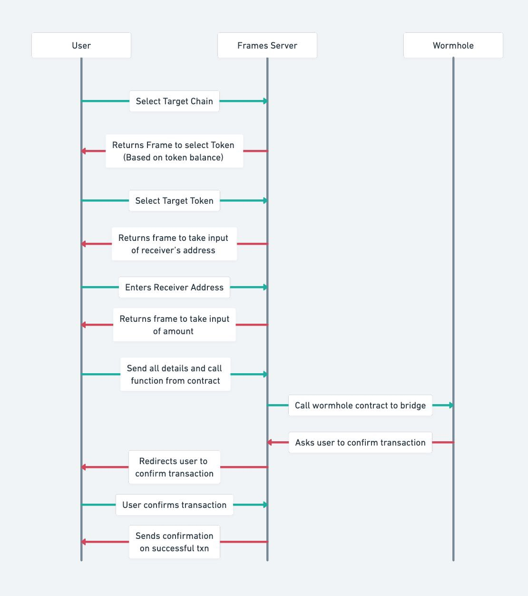

CCTP Frame leverages Wormhole's cross-chain communication protocol to facilitate USDC bridging. Farcaster Frames is used to build the user interface and interact with the Wormhole smart contracts on the respective blockchains.

## Architecture

## Wormhole Integration

CCTP Frame leverages Wormhole's integration with Circle's Cross-Chain Transfer Protocol (CCTP) to enable fast, cheap, and native USDC bridging between Base, Arbitrum, Optimism, and Avalanche. Wormhole builds on top of CCTP and adds several useful features to make the process simpler and more user-friendly.

1. USDC is burned on the source chain: Using the CCTP Frame app, a user initiates a transfer of USDC from one of the supported blockchains (Base, Arbitrum, Optimism, or Avalanche) to another and specifies the recipient wallet address on the destination chain. The app facilitates a burn of the specified amount of USDC on the source chain.
2. A signed attestation is fetched from Circle: Circle observes and attests to the burn event on the source chain. The CCTP Frame app requests the attestation from Circle, which provides authorization to mint the specified amount of USDC on the destination chain.
3. Automatic Relaying: To complete the CCTP transfer, the Circle attestation must be delivered to the destination chain. Wormhole's CCTP Relayer automatically delivers the attestation and completes the transfer, charging a small fee for this service. This feature eliminates the need for users to manually redeem USDC transfers themselves.
4. USDC is minted on the destination chain: The CCTP Frame app uses the attestation to trigger the minting of USDC. The specified amount of USDC is minted on the destination chain and sent to the recipient wallet address.

CCTP Frame currently supports USDC bridging between Base, Arbitrum, Optimism, and Avalanche, enabling developers to build multi-chain applications that provide seamless and efficient cross-chain experiences for their users within these ecosystems. The integration with Wormhole's CCTP Relayer further enhances the user experience by simplifying the transfer process.

## Farcaster Frames

Farcaster Frames is used to build the user interface for CCTP Frame. It allows users to interact with the Wormhole smart contracts through a web browser or by casting frames on Warpcast.
